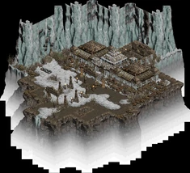
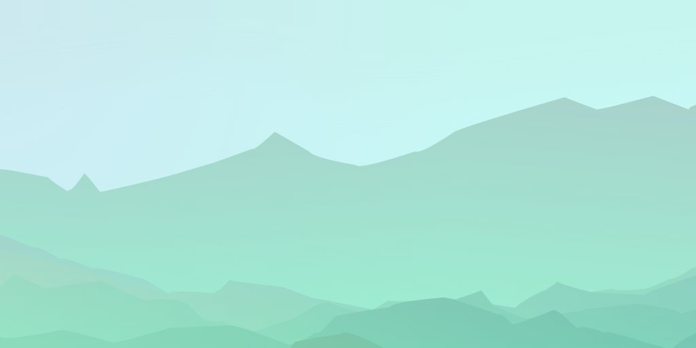
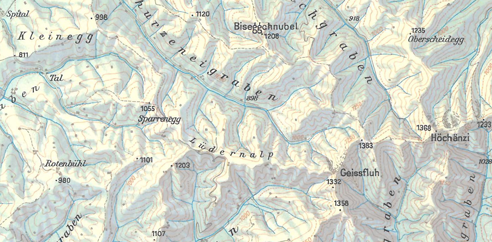
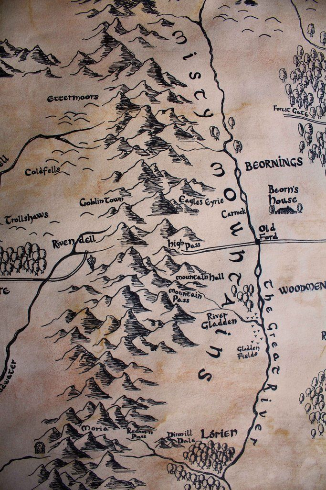
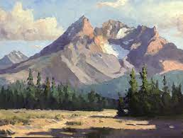
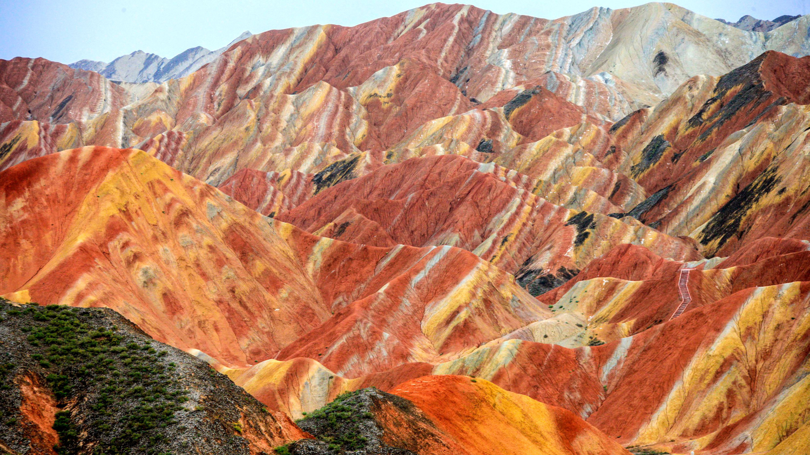
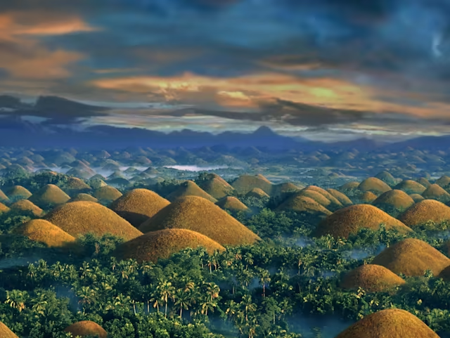
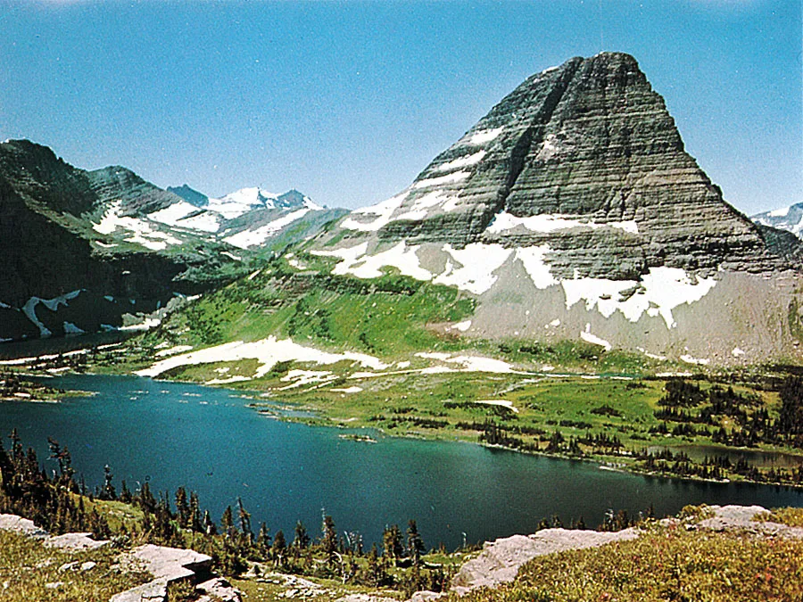
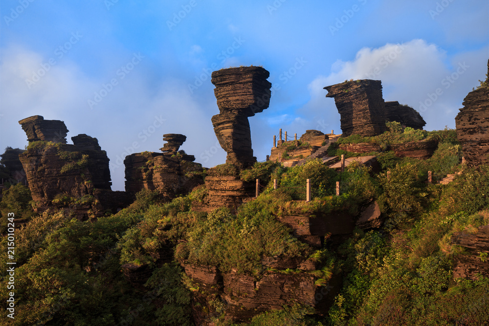
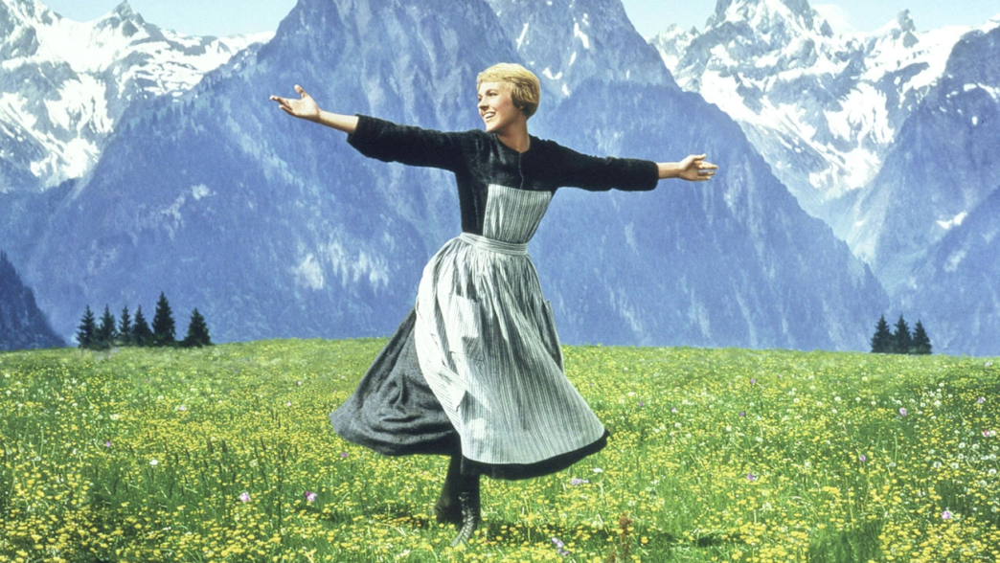

> How many ways can you think of to simulate a mountain range?
>
> So far I have:
> - generate it with Perlin noise that looks like mountains and ridges
> - stamp down a pre-constructed mountain from GIS data
> - use constraint-solving or machine-learning to alter a heightmap to conform to the learned example mountains
> - simulate the development of the model through tectonics and erosion and so on
>
> I'm performing deliberate ontological shattering by asking this question, so the more examples the better.

Hooo buddy, as a professional mountain-generator....

* Spore-style: particles simulated with forces that leave behind stamps into a height map
* Later Spore-style: particles leave behind curve control points, which are used to make a "ribbon" of warped stamp rectangles (Illustrators "art" brush works the same)
  
* Diamond-square algorithm https://en.wikipedia.org/wiki/Diamond-square_algorithm  
   
 looks similar to Perlin, but has the advantage of being calculated from local points, so you can use it to patch between hand authored or constrained segments

* Straight up path generation, in SSX: you don't care where the mountain is relative to ...anything, just the snowboarding paths down it https://www.gdcvault.com/play/1015547/Asking-the-Impossible-on-SSX

### How many ways can you think of to simulate a mountain range?

The question for any "how can I generate X" is always: for what use case  
ie, Diablo: "I want mountain feel, on a completely flat plain"

or Desert Golfing: height changes are interesting, therefore a mountain is a level that goes UP or DOWN: http://www.joshuakehn.com/2014/10/16/desert-golfing.html

You can generate a mountain with Dall-E, but you can also generate it with GPT2 for a text adventure. 

What is a mountain *about*? Maybe about height or difficulty or paths.

Maybe it's about the soft edges fading into the sky: https://twitter.com/softlandscapes/status/1549288828266917888/photo/1

**There is no thing-generator.  
There is only a thing-aboutness generator.**

### How many ways are there to paint a mountain?

  
  
  
  
  

If you give me an algorithm, a sine wave or madlibs or tarot cards or GPT3 or tracery, I will generate a mountain for you.

Also a tree, a love poem, and the feeling of seeing a seagull very far away.

Also we often generate our idea of mountains so that they seem real.  
Real mountains have no obligation to seem real.

This is a big issue with cloud generation.  
Clouds look fake as hell.

Images of mountains getting away with some BULLSHIT on account of being real:

  
  
  

Plus all the mountain-ness that isn't about the big geometric shape.  The animals, the wind, the sunshine, the silence, the scrubby plants, the inappropriate meadows exploding after a snowmelt.

You can describe mountainness without even having a mountain in the scene.

And there have been mountains that you've been on that you might describe entirely differently, with warmth or colors.  Or one mountain that would have a hundred different vignettes of seasons and weather and stages in your life to describe it.

I think generators will get much better when we stop trying to write wikipedia articles, and start writing intensely specific poems.